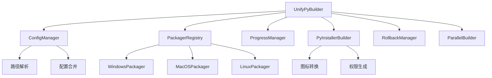

# UnifyPy 2.0

> 专业的跨平台Python应用打包解决方案

## 🚀 项目简介

UnifyPy 2.0 是一个企业级跨平台Python应用打包工具，支持将Python项目打包为Windows、macOS、Linux平台的原生安装包。

### ✨ 核心特性

- **🔄 多平台支持（64位）**: Windows (EXE)、macOS (DMG)、Linux (DEB+RPM)
- **⚡ 并行构建**: 支持多格式并行生成，显著提升构建效率
- **🛡️ 企业级功能**: 自动回滚、会话管理、智能错误处理
- **🎨 优秀体验**: Rich进度条、分阶段显示、详细日志
- **🔧 完整配置**: 支持30+PyInstaller参数，JSON配置化
- **📦 自动化工具**: 第三方工具自动下载和管理
- **🍎 macOS权限管理**: 自动生成权限文件、代码签名支持
- **📊 智能路径处理**: 相对路径自动解析为绝对路径
- **🔄 模块化架构**: 基于注册表的插件式打包器设计

## 📦 安装要求

### 系统要求
- Python 3.8+
- Windows 10+ / macOS 10.14+ / Linux (Ubuntu 18.04+)

### 安装与使用
```bash
# 开发安装（推荐）
pip install -e .

# 或安装发布包（如已发布到 PyPI）
# pip install unifypy

# 运行命令
unifypy . --config build.json
```

主要依赖：
- pyinstaller >= 6.0
- rich >= 12.0
- requests >= 2.28
- packaging >= 21.0
- pillow >= 8.0 (可选，用于图标转换)

**平台特定工具**：
- **Windows**: Inno Setup (自动检测)
- **macOS**: create-dmg (内置)、Xcode Command Line Tools
- **Linux**: dpkg-dev, rpm-build, fakeroot (按需自动安装指导)

## 🚀 快速开始

### 基本用法

```bash
# 使用配置文件打包
unifypy . --config build.json

# 命令行快速打包
unifypy . --name myapp --version 1.0.0 --entry main.py --onefile

# 多格式并行构建
unifypy . --config build_multiformat.json --parallel --max-workers 4

# 详细输出模式
unifypy . --config build.json --verbose

# 清理重新构建
unifypy . --config build.json --clean --verbose

# 只生成可执行文件，跳过安装包
unifypy . --config build.json --skip-installer

# 指定特定格式
unifypy . --config build.json --format dmg --parallel

# macOS开发模式（自动权限配置）
unifypy . --config build.json --development --verbose

# 仅预检（不构建）
unifypy . --config build.json --dry-run
```

### 配置文件示例

创建 `build.json` 配置文件：

```json
{
  "name": "MyApp",
  "display_name": "我的应用程序", 
  "version": "1.0.0",
  "publisher": "我的公司",
  "entry": "main.py",
  "icon": "assets/icon.png",
  
  "pyinstaller": {
    "onefile": false,
    "windowed": true,
    "clean": true,
    "noconfirm": true,
    "add_data": ["assets:assets", "config:config"],
    "hidden_import": ["requests", "json", "tkinter"]
  },
  
  "platforms": {
    "windows": {
      "pyinstaller": {
        "add_data": ["assets;assets", "config;config"]
      },
      "inno_setup": {
        "create_desktop_icon": true,
        "create_start_menu_icon": true,
        "languages": ["english", "chinesesimplified"],
        "license_file": "LICENSE",
        "setup_icon": "assets/installer.ico"
      }
    },
    "macos": {
      "bundle_identifier": "com.mycompany.myapp",
      "microphone_usage_description": "需要麦克风权限进行语音功能",
      "camera_usage_description": "需要摄像头权限进行视频功能",
      "dmg": {
        "volname": "MyApp 安装器",
        "window_size": [600, 400],
        "icon_size": 100
      }
    },
    "linux": {
      "deb": {
        "package": "myapp",
        "depends": ["python3 (>= 3.8)", "libgtk-3-0"],
        "description": "我的Python应用程序"
      },
      "appimage": {
        "desktop_entry": true,
        "categories": "Utility;Development;"
      }
    }
  }
}
```

## 🔧 命令行参数

### 基本语法
```bash
unifypy <project_dir> [选项]
```

### 基本信息参数
| 参数 | 说明 | 示例 |
|------|------|------|
| `project_dir` | Python项目根目录路径（必需） | `. 或 /path/to/project` |
| `--config CONFIG` | 配置文件路径 (JSON格式) | `--config build.json` |
| `--name NAME` | 应用程序名称 | `--name MyApp` |
| `--display-name DISPLAY_NAME` | 应用程序显示名称 | `--display-name "我的应用"` |
| `--entry ENTRY` | 入口Python文件 | `--entry main.py` |
| `--version VERSION` | 应用程序版本 | `--version 1.0.0` |
| `--publisher PUBLISHER` | 发布者名称 | `--publisher "我的公司"` |

### 文件和资源参数
| 参数 | 说明 | 示例 |
|------|------|------|
| `--icon ICON` | 图标文件路径 | `--icon assets/app.png` |
| `--license LICENSE` | 许可证文件路径 | `--license LICENSE.txt` |
| `--readme README` | 自述文件路径 | `--readme README.md` |
| `--hooks HOOKS` | 运行时钩子目录 | `--hooks hooks/` |

### PyInstaller选项
| 参数 | 说明 | 示例 |
|------|------|------|
| `--onefile` | 生成单文件模式的可执行文件 | `--onefile` |
| `--windowed` | 窗口模式（不显示控制台） | `--windowed` |
| `--console` | 控制台模式 | `--console` |

### 构建控制选项
| 参数 | 说明 | 示例 |
|------|------|------|
| `--skip-exe` | 跳过可执行文件构建 | `--skip-exe` |
| `--skip-installer` | 跳过安装程序构建 | `--skip-installer` |
| `--clean` | 清理之前的构建文件 | `--clean` |
| `--format FORMAT` | 指定输出格式 | `--format dmg` |

### 工具路径选项
| 参数 | 说明 | 示例 |
|------|------|------|
| `--inno-setup-path INNO_SETUP_PATH` | Inno Setup可执行文件路径 | `--inno-setup-path /path/to/ISCC.exe` |

### 输出控制选项
| 参数 | 说明 | 示例 |
|------|------|------|
| `--verbose, -v` | 显示详细输出 | `--verbose` 或 `-v` |
| `--quiet, -q` | 静默模式 | `--quiet` 或 `-q` |

### 性能优化选项
| 参数 | 说明 | 示例 |
|------|------|------|
| `--parallel` | 启用并行构建 | `--parallel` |
| `--max-workers MAX_WORKERS` | 最大并行工作线程数 | `--max-workers 4` |

### 回滚系统选项
| 参数 | 说明 | 示例 |
|------|------|------|
| `--no-rollback` | 禁用自动回滚 | `--no-rollback` |
| `--rollback SESSION_ID` | 执行指定会话的回滚 | `--rollback abc123` |
| `--list-rollback` | 列出可用的回滚会话 | `--list-rollback` |

### macOS开发选项
| 参数 | 说明 | 示例 |
|------|------|------|
| `--development` | 强制开发版本（启用调试权限） | `--development` |
| `--production` | 生产版本（禁用调试权限，仅用于签名应用） | `--production` |

### 帮助选项
| 参数 | 说明 | 示例 |
|------|------|------|
| `-h, --help` | 显示帮助信息并退出 | `--help` |

## 📋 支持的打包格式

### Windows
- **EXE** (Inno Setup) - 标准安装程序

### macOS  
- **DMG** - 磁盘映像安装包

### Linux
- **DEB** - Debian/Ubuntu包
- **RPM** - Red Hat/CentOS包

## ⚙️ 配置文件详解

### 全局配置
```json
{
  "name": "应用名称",
  "display_name": "显示名称", 
  "version": "版本号",
  "publisher": "发布者",
  "entry": "入口文件",
  "icon": "图标文件",
  "license": "许可证文件",
  "readme": "说明文件"
}
```

### PyInstaller配置
```json
{
  "pyinstaller": {
    "onefile": false,
    "windowed": true,
    "clean": true,
    "noconfirm": true,
    "optimize": 2,
    "strip": true,
    "add_data": ["源路径:目标路径"],
    "hidden_import": ["模块名"],
    "exclude_module": ["排除的模块"]
  }
}
```

### macOS特定配置
```json
{
  "platforms": {
    "macos": {
      "bundle_identifier": "com.company.app",
      "minimum_system_version": "10.14.0",
      "category": "public.app-category.productivity",
      
      "microphone_usage_description": "需要麦克风权限进行语音功能",
      "camera_usage_description": "需要摄像头权限进行视频功能",
      
      "dmg": {
        "volname": "安装器名称",
        "window_size": [600, 400],
        "icon_size": 100
      }
    }
  }
}
```

## 🔄 并行构建

UnifyPy 2.0 支持多格式并行构建，显著提升构建效率：

```bash
# 启用并行构建
unifypy . --config build_multiformat.json --parallel

# 指定工作线程数
unifypy . --parallel --max-workers 4

# 查看并行构建效果
unifypy . --config build_comprehensive.json --parallel --verbose
```

## 🛡️ 回滚系统

自动跟踪构建操作，支持一键回滚：

```bash
# 列出可用的回滚会话
unifypy . --list-rollback

# 执行回滚
unifypy . --rollback SESSION_ID

# 禁用自动回滚
unifypy . --config build.json --no-rollback
```

## 🍎 macOS 特殊功能

### 自动权限管理
UnifyPy 2.0 为 macOS 应用提供了完整的权限管理方案：

```bash
# 开发模式 - 自动生成权限文件，适合开发和测试
unifypy . --config build.json --development

# 生产模式 - 用于已签名应用
unifypy . --config build.json --production
```

### 权限配置示例
```json
{
  "platforms": {
    "macos": {
      "bundle_identifier": "com.company.myapp",
      "microphone_usage_description": "需要麦克风权限进行语音功能",
      "camera_usage_description": "需要摄像头权限进行视频功能", 
      "location_usage_description": "需要位置权限提供基于位置的服务"
    }
  }
}
```

### 自动化功能
- ✅ 自动生成 entitlements.plist
- ✅ 自动更新 Info.plist 权限描述  
- ✅ 自动 ad-hoc 代码签名
- ✅ 自动图标格式转换（PNG → ICNS）

## 🔄 智能路径处理

UnifyPy 2.0 解决了跨目录打包时的路径问题：

### 问题场景
```bash
# 从 UnifyPy 目录打包其他项目
cd /path/to/UnifyPy
unifypy ../my-project --config ../my-project/build.json
```

### 智能解决方案
配置文件中的相对路径会自动解析为相对于**目标项目目录**：
- ✅ `"icon": "assets/icon.png"` → `/path/to/my-project/assets/icon.png`  
- ✅ `"add_data": ["data:data"]` → `/path/to/my-project/data:data`
- ✅ 支持嵌套配置和平台特定路径

### 支持的路径字段
- 单文件：`icon`, `license`, `readme`, `entry`, `setup_icon`, `version_file`
- 数组字段：`add_data`, `add_binary`, `datas`, `binaries`
- 格式：支持 `source:dest` 和 `source;dest` 两种分隔符

## 🏗️ 架构设计

UnifyPy 2.0 采用现代化的模块化架构设计：

### 核心设计模式

**注册表模式 (Registry Pattern)**
```python
# 动态注册和查找打包器
packager_registry = PackagerRegistry()
packager_class = packager_registry.get_packager("macos", "dmg")
```

**工厂模式 (Factory Pattern)**
```python
# 通过注册表创建平台特定的打包器
packager = packager_class(progress, runner, tool_manager, config)
```

**策略模式 (Strategy Pattern)**  
```python
# 每个打包器实现特定格式的打包策略
class DMGPackager(BasePackager):
    def package(self, format_type, source_path, output_path):
        # DMG特定的打包逻辑
```

**建造者模式 (Builder Pattern)**
```python  
# 构建复杂的PyInstaller配置
builder = PyInstallerConfigBuilder()
command = builder.build_command(config, entry_script)
```

### 核心组件交互



### 构建流程

1. **初始化阶段**
   - 解析命令行参数
   - 加载和合并配置文件
   - 验证项目结构和依赖

2. **预处理阶段**  
   - 智能路径解析（相对→绝对）
   - 创建构建目录和临时文件
   - macOS 权限文件自动生成

3. **可执行文件构建**
   - PyInstaller 配置构建
   - 图标格式自动转换
   - macOS Info.plist 更新和代码签名

4. **安装包生成**
   - 根据平台选择合适的打包器
   - 支持并行构建多种格式
   - 自动验证输出文件

5. **后处理阶段**
   - 清理临时文件
   - 显示构建结果
   - 回滚数据保存

## 📁 项目结构

```
UnifyPy/
├── main.py                 # 主入口文件
├── requirements.txt        # Python依赖
├── build.json             # 标准配置示例
├── build_multiformat.json # 多格式配置
├── build_comprehensive.json # 完整配置示例
├── py-xiaozhi.json        # 实际项目配置示例
└── unifypy/              # 源代码
    ├── core/             # 核心模块（engine、plugin、events、context、config、platforms）
    ├── platforms/        # 平台打包器（registry、windows/macos/linux）
    ├── pyinstaller/      # PyInstaller 配置构建
    ├── templates/        # 模板文件（如 Inno Setup 模板等）
    ├── tools/            # 内置工具（如 create-dmg）
    └── utils/            # 工具模块（progress、rollback、parallel_builder 等）
```

## 🔍 故障排除

### 常见问题

**Q: PyInstaller打包失败？**
```bash
# 检查依赖
pip install pyinstaller>=5.0

# 清理重试
unifypy . --config build.json --clean --verbose
```

**Q: macOS权限配置问题？**
```bash
# 使用开发模式自动生成权限文件
unifypy . --config build.json --development --verbose

# 检查生成的权限文件
cat auto_generated_entitlements.plist
```
- 检查配置文件中的权限描述
- 确保Bundle ID格式正确（com.company.appname）
- 参考 `build_macos_permissions_example.json`

**Q: Linux依赖缺失？**
```bash
# Ubuntu/Debian
sudo apt-get install dpkg-dev fakeroot

# CentOS/RHEL  
sudo yum install rpm-build
```

**Q: 并行构建失败？**
```bash
# 减少工作线程数
unifypy . --parallel --max-workers 2

# 或禁用并行构建
unifypy . --config build.json
```

**Q: 配置文件中的路径找不到？**
```bash
# 确保相对路径是相对于项目目录的
# ✅ 正确：项目在 /path/to/myapp，图标在 /path/to/myapp/assets/icon.png
"icon": "assets/icon.png"

# ❌ 错误：使用相对于UnifyPy目录的路径
"icon": "../myapp/assets/icon.png" 

# 检查路径解析
unifypy . --config build.json --verbose
```

### 调试技巧

1. **启用详细输出**: `--verbose`
2. **检查日志**: 查看构建过程详细信息
3. **单步构建**: 使用 `--skip-exe` 或 `--skip-installer`
4. **回滚测试**: 使用 `--list-rollback` 查看历史
5. **路径问题**: 检查配置文件中的相对路径是否正确
6. **权限问题**: macOS使用 `--development` 模式进行调试

## 📝 最佳实践

### 配置文件管理
- 使用不同环境的配置文件（开发、测试、生产）
- 版本控制中包含配置文件模板
- 敏感信息使用环境变量

### 构建优化
- 启用并行构建提升效率
- 合理配置 `exclude_module` 减小包体积
- 使用 `clean` 确保构建环境干净

### 跨平台兼容
- 路径分隔符使用 `/` 或自动处理
- 图标格式让工具自动转换（PNG→ICNS/ICO）
- 测试不同平台的依赖兼容性
- **重要**: 配置文件中的相对路径会自动解析为相对于项目目录的绝对路径

## 📄 许可证

MIT License - 详见 [LICENSE](LICENSE) 文件

## 🤝 贡献

欢迎提交 Issue 和 Pull Request！

---

UnifyPy 2.0 - 让Python应用打包变得简单高效 🚀
