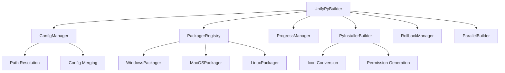

# UnifyPy 2.0

> Professional Cross-Platform Python Application Packaging Solution

## 🚀 Project Overview

UnifyPy 2.0 is an enterprise-grade cross-platform Python application packaging tool that supports packaging Python projects into native installers for Windows, macOS, and Linux platforms.

### ✨ Core Features

- **🔄 Multi-Platform Support**: Windows (EXE+MSI), macOS (DMG), Linux (DEB+RPM+AppImage+TarGZ)
- **⚡ Parallel Building**: Support multi-format parallel generation, significantly improving build efficiency
- **🛡️ Enterprise Features**: Automatic rollback, session management, intelligent error handling
- **🎨 Excellent Experience**: Rich progress bars, staged display, detailed logging
- **🔧 Complete Configuration**: Support 30+ PyInstaller parameters, JSON configuration
- **📦 Automated Tools**: Automatic download and management of third-party tools
- **🍎 macOS Permission Management**: Auto-generate permission files, code signing support
- **📊 Smart Path Handling**: Automatic resolution of relative paths to absolute paths
- **🔄 Modular Architecture**: Plugin-based packager design using registry pattern

## 📦 Installation Requirements

### System Requirements
- Python 3.8+
- Windows 10+ / macOS 10.14+ / Linux (Ubuntu 18.04+)

### Dependency Installation
```bash
pip install -r requirements.txt
```

Main dependencies:
- pyinstaller >= 6.0
- rich >= 12.0
- requests >= 2.28
- packaging >= 21.0
- pillow >= 8.0 (optional, for icon conversion)

**Platform-specific tools**:
- **Windows**: Inno Setup (auto-detected)
- **macOS**: create-dmg (bundled), Xcode Command Line Tools
- **Linux**: dpkg-dev, rpm-build, fakeroot (auto-install guidance as needed)

## 🚀 Quick Start

### Basic Usage

```bash
# Package using configuration file
python main.py . --config build.json

# Quick packaging via command line
python main.py . --name myapp --version 1.0.0 --entry main.py --onefile

# Multi-format parallel build
python main.py . --config build_multiformat.json --parallel --max-workers 4

# Verbose output mode
python main.py . --config build.json --verbose

# Clean rebuild
python main.py . --config build.json --clean --verbose

# Generate executable only, skip installer
python main.py . --config build.json --skip-installer

# Specify specific format
python main.py . --config build.json --format dmg --parallel

# macOS development mode (automatic permission configuration)
python main.py . --config build.json --development --verbose

# Cross-directory packaging (solve path issues)
python /path/to/UnifyPy/main.py /path/to/project --config /path/to/project/build.json
```

### Configuration File Example

Create `build.json` configuration file:

```json
{
  "name": "MyApp",
  "display_name": "My Application", 
  "version": "1.0.0",
  "publisher": "My Company",
  "entry": "main.py",
  "icon": "assets/icon.png",
  
  "pyinstaller": {
    "onefile": false,
    "windowed": true,
    "clean": true,
    "noconfirm": true,
    "add_data": ["assets:assets", "config:config"],
    "hidden_import": ["requests", "json", "tkinter"]
  },
  
  "platforms": {
    "windows": {
      "pyinstaller": {
        "add_data": ["assets;assets", "config;config"]
      },
      "inno_setup": {
        "create_desktop_icon": true,
        "create_start_menu_icon": true,
        "languages": ["english", "chinesesimplified"],
        "license_file": "LICENSE",
        "setup_icon": "assets/installer.ico"
      }
    },
    "macos": {
      "bundle_identifier": "com.mycompany.myapp",
      "microphone_usage_description": "Microphone access required for voice features",
      "camera_usage_description": "Camera access required for video features",
      "dmg": {
        "volname": "MyApp Installer",
        "window_size": [600, 400],
        "icon_size": 100
      }
    },
    "linux": {
      "deb": {
        "package": "myapp",
        "depends": ["python3 (>= 3.8)", "libgtk-3-0"],
        "description": "My Python Application"
      },
      "appimage": {
        "desktop_entry": true,
        "categories": "Utility;Development;"
      }
    }
  }
}
```

## 🔧 Command Line Arguments

### Basic Syntax
```bash
python main.py <project_dir> [options]
```

### Basic Information Parameters
| Parameter | Description | Example |
|-----------|-------------|---------|
| `project_dir` | Python project root directory path (required) | `. or /path/to/project` |
| `--config CONFIG` | Configuration file path (JSON format) | `--config build.json` |
| `--name NAME` | Application name | `--name MyApp` |
| `--display-name DISPLAY_NAME` | Application display name | `--display-name "My Application"` |
| `--entry ENTRY` | Entry Python file | `--entry main.py` |
| `--version VERSION` | Application version | `--version 1.0.0` |
| `--publisher PUBLISHER` | Publisher name | `--publisher "My Company"` |

### File and Resource Parameters
| Parameter | Description | Example |
|-----------|-------------|---------|
| `--icon ICON` | Icon file path | `--icon assets/app.png` |
| `--license LICENSE` | License file path | `--license LICENSE.txt` |
| `--readme README` | README file path | `--readme README.md` |
| `--hooks HOOKS` | Runtime hooks directory | `--hooks hooks/` |

### PyInstaller Options
| Parameter | Description | Example |
|-----------|-------------|---------|
| `--onefile` | Generate single-file executable | `--onefile` |
| `--windowed` | Windowed mode (no console) | `--windowed` |
| `--console` | Console mode | `--console` |

### Build Control Options
| Parameter | Description | Example |
|-----------|-------------|---------|
| `--skip-exe` | Skip executable build | `--skip-exe` |
| `--skip-installer` | Skip installer build | `--skip-installer` |
| `--clean` | Clean previous build files | `--clean` |
| `--format FORMAT` | Specify output format | `--format dmg` |

### Tool Path Options
| Parameter | Description | Example |
|-----------|-------------|---------|
| `--inno-setup-path INNO_SETUP_PATH` | Inno Setup executable path | `--inno-setup-path /path/to/ISCC.exe` |

### Output Control Options
| Parameter | Description | Example |
|-----------|-------------|---------|
| `--verbose, -v` | Show verbose output | `--verbose` or `-v` |
| `--quiet, -q` | Silent mode | `--quiet` or `-q` |

### Performance Optimization Options
| Parameter | Description | Example |
|-----------|-------------|---------|
| `--parallel` | Enable parallel building | `--parallel` |
| `--max-workers MAX_WORKERS` | Maximum parallel worker threads | `--max-workers 4` |

### Rollback System Options
| Parameter | Description | Example |
|-----------|-------------|---------|
| `--no-rollback` | Disable automatic rollback | `--no-rollback` |
| `--rollback SESSION_ID` | Execute rollback for specified session | `--rollback abc123` |
| `--list-rollback` | List available rollback sessions | `--list-rollback` |

### macOS Development Options
| Parameter | Description | Example |
|-----------|-------------|---------|
| `--development` | Force development version (enable debug permissions) | `--development` |
| `--production` | Production version (disable debug permissions, for signed apps only) | `--production` |

### Help Options
| Parameter | Description | Example |
|-----------|-------------|---------|
| `-h, --help` | Show help information and exit | `--help` |

## 📋 Supported Packaging Formats

### Windows
- **EXE** (Inno Setup) - Standard installer
- **MSI** - Windows Installer package

### macOS  
- **DMG** - Disk image installer

### Linux
- **DEB** - Debian/Ubuntu package
- **RPM** - Red Hat/CentOS package
- **AppImage** - Portable application image
- **TAR.GZ** - Source archive

## ⚙️ Configuration File Details

### Global Configuration
```json
{
  "name": "Application Name",
  "display_name": "Display Name", 
  "version": "Version Number",
  "publisher": "Publisher",
  "entry": "Entry File",
  "icon": "Icon File",
  "license": "License File",
  "readme": "README File"
}
```

### PyInstaller Configuration
```json
{
  "pyinstaller": {
    "onefile": false,
    "windowed": true,
    "clean": true,
    "noconfirm": true,
    "optimize": 2,
    "strip": true,
    "add_data": ["source_path:target_path"],
    "hidden_import": ["module_name"],
    "exclude_module": ["excluded_module"]
  }
}
```

### macOS Specific Configuration
```json
{
  "platforms": {
    "macos": {
      "bundle_identifier": "com.company.app",
      "minimum_system_version": "10.14.0",
      "category": "public.app-category.productivity",
      
      "microphone_usage_description": "Microphone access required for voice features",
      "camera_usage_description": "Camera access required for video features",
      
      "dmg": {
        "volname": "Installer Name",
        "window_size": [600, 400],
        "icon_size": 100
      }
    }
  }
}
```

## 🔄 Parallel Building

UnifyPy 2.0 supports multi-format parallel building to significantly improve build efficiency:

```bash
# Enable parallel building
python main.py . --config build_multiformat.json --parallel

# Specify number of worker threads
python main.py . --parallel --max-workers 4

# View parallel building effects
python main.py . --config build_comprehensive.json --parallel --verbose
```

## 🛡️ Rollback System

Automatically track build operations with one-click rollback support:

```bash
# List available rollback sessions
python main.py . --list-rollback

# Execute rollback
python main.py . --rollback SESSION_ID

# Disable automatic rollback
python main.py . --config build.json --no-rollback
```

## 🍎 macOS Special Features

### Automatic Permission Management
UnifyPy 2.0 provides a complete permission management solution for macOS applications:

```bash
# Development mode - auto-generate permission files, suitable for development and testing
python main.py . --config build.json --development

# Production mode - for signed applications
python main.py . --config build.json --production
```

### Permission Configuration Example
```json
{
  "platforms": {
    "macos": {
      "bundle_identifier": "com.company.myapp",
      "microphone_usage_description": "Microphone access required for voice features",
      "camera_usage_description": "Camera access required for video features", 
      "location_usage_description": "Location access required for location-based services"
    }
  }
}
```

### Automated Features
- ✅ Auto-generate entitlements.plist
- ✅ Auto-update Info.plist permission descriptions  
- ✅ Auto ad-hoc code signing
- ✅ Auto icon format conversion (PNG → ICNS)

## 🔄 Smart Path Handling

UnifyPy 2.0 solves path issues when packaging across directories:

### Problem Scenario
```bash
# Packaging other projects from UnifyPy directory
cd /path/to/UnifyPy
python main.py ../my-project --config ../my-project/build.json
```

### Smart Solution
Relative paths in configuration files are automatically resolved relative to the **target project directory**:
- ✅ `"icon": "assets/icon.png"` → `/path/to/my-project/assets/icon.png`  
- ✅ `"add_data": ["data:data"]` → `/path/to/my-project/data:data`
- ✅ Support nested configurations and platform-specific paths

### Supported Path Fields
- Single files: `icon`, `license`, `readme`, `entry`, `setup_icon`, `version_file`
- Array fields: `add_data`, `add_binary`, `datas`, `binaries`
- Formats: Support both `source:dest` and `source;dest` separators

## 🏗️ Architecture Design

UnifyPy 2.0 adopts modern modular architecture design:

### Core Design Patterns

**Registry Pattern**
```python
# Dynamically register and lookup packagers
packager_registry = PackagerRegistry()
packager_class = packager_registry.get_packager("macos", "dmg")
```

**Factory Pattern**
```python
# Create platform-specific packagers through registry
packager = packager_class(progress, runner, tool_manager, config)
```

**Strategy Pattern**  
```python
# Each packager implements specific format packaging strategy
class DMGPackager(BasePackager):
    def package(self, format_type, source_path, output_path):
        # DMG-specific packaging logic
```

**Builder Pattern**
```python  
# Build complex PyInstaller configurations
builder = PyInstallerConfigBuilder()
command = builder.build_command(config, entry_script)
```

### Core Component Interactions



### Build Process

1. **Initialization Phase**
   - Parse command line arguments
   - Load and merge configuration files
   - Validate project structure and dependencies

2. **Preprocessing Phase**  
   - Smart path resolution (relative→absolute)
   - Create build directories and temporary files
   - macOS permission file auto-generation

3. **Executable Building**
   - PyInstaller configuration building
   - Automatic icon format conversion
   - macOS Info.plist update and code signing

4. **Installer Generation**
   - Select appropriate packager based on platform
   - Support parallel building of multiple formats
   - Auto-validate output files

5. **Post-processing Phase**
   - Clean temporary files
   - Display build results
   - Save rollback data

## 📁 Project Structure

```
UnifyPy/
├── main.py                 # Main entry file
├── requirements.txt        # Python dependencies
├── build.json             # Standard configuration example
├── build_multiformat.json # Multi-format configuration
├── build_comprehensive.json # Complete configuration example
├── py-xiaozhi.json        # Real project configuration example
└── src/                   # Source code
    ├── core/             # Core modules
    │   ├── config.py     # Configuration management (supports path resolution)
    │   └── environment.py # Environment detection
    ├── platforms/        # Platform packagers (registry pattern)
    │   ├── base.py       # Packager base class
    │   ├── registry.py   # Packager registry
    │   ├── windows/      # Windows packagers (EXE+MSI)
    │   ├── macos/        # macOS packagers (DMG+PKG+ZIP) 
    │   └── linux/        # Linux packagers (DEB+RPM+AppImage+TarGZ)
    ├── pyinstaller/      # PyInstaller integration
    │   ├── builder.py    # Builder
    │   └── config_builder.py # Configuration builder
    ├── templates/        # Template files
    │   └── setup.iss.template # Inno Setup script template
    ├── tools/            # Built-in tools
    │   └── create-dmg/   # macOS DMG generation tool
    └── utils/            # Utility modules
        ├── progress.py   # Rich progress bar management
        ├── rollback.py   # Rollback system
        ├── parallel_builder.py # Parallel building
        ├── icon_converter.py   # Icon conversion
        ├── info_plist_updater.py # macOS permission updates
        └── macos_codesign.py   # macOS code signing
```

## 🔍 Troubleshooting

### Common Issues

**Q: PyInstaller packaging failed?**
```bash
# Check dependencies
pip install pyinstaller>=5.0

# Clean and retry
python main.py . --config build.json --clean --verbose
```

**Q: macOS permission configuration issues?**
```bash
# Use development mode to auto-generate permission files
python main.py . --config build.json --development --verbose

# Check generated permission files
cat auto_generated_entitlements.plist
```
- Check permission descriptions in configuration file
- Ensure Bundle ID format is correct (com.company.appname)
- Refer to `build_macos_permissions_example.json`

**Q: Linux dependencies missing?**
```bash
# Ubuntu/Debian
sudo apt-get install dpkg-dev fakeroot

# CentOS/RHEL  
sudo yum install rpm-build
```

**Q: Parallel build failed?**
```bash
# Reduce number of worker threads
python main.py . --parallel --max-workers 2

# Or disable parallel building
python main.py . --config build.json
```

**Q: Configuration file paths not found?**
```bash
# Ensure relative paths are relative to project directory
# ✅ Correct: Project at /path/to/myapp, icon at /path/to/myapp/assets/icon.png
"icon": "assets/icon.png"

# ❌ Wrong: Using paths relative to UnifyPy directory
"icon": "../myapp/assets/icon.png" 

# Check path resolution
python main.py . --config build.json --verbose
```

### Debugging Tips

1. **Enable verbose output**: `--verbose`
2. **Check logs**: View detailed build process information
3. **Step-by-step build**: Use `--skip-exe` or `--skip-installer`
4. **Rollback testing**: Use `--list-rollback` to view history
5. **Path issues**: Check if relative paths in config file are correct
6. **Permission issues**: Use `--development` mode on macOS for debugging

## 📝 Best Practices

### Configuration File Management
- Use different configuration files for different environments (development, testing, production)
- Include configuration file templates in version control
- Use environment variables for sensitive information

### Build Optimization
- Enable parallel building to improve efficiency
- Configure `exclude_module` appropriately to reduce package size
- Use `clean` to ensure clean build environment

### Cross-Platform Compatibility
- Use `/` for path separators or let tools handle automatically
- Let tools automatically convert icon formats (PNG→ICNS/ICO)
- Test dependency compatibility across different platforms
- **Important**: Relative paths in config files are automatically resolved to absolute paths relative to project directory

## 📄 License

MIT License - See [LICENSE](LICENSE) file for details

## 🤝 Contributing

Issues and Pull Requests are welcome!

---

UnifyPy 2.0 - Making Python Application Packaging Simple and Efficient 🚀