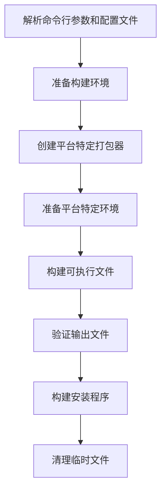

# UnifyPy 架构设计

## 1. 项目概述

UnifyPy是一个跨平台的自动化打包解决方案，可以将任何Python项目打包成独立的可执行文件和相应平台的安装程序。工具支持Windows、macOS和Linux三大主要操作系统，提供统一的接口和丰富的配置选项。

### 1.1 功能特点

- 自动化打包Python项目为独立可执行程序（基于PyInstaller）
- 自动生成各平台对应的安装程序（Windows/macOS/Linux）
- 支持自定义应用名称、版本、图标等元数据
- 支持通过JSON配置文件或命令行参数进行灵活配置
- 自动检测并安装所需依赖工具
- 支持自定义钩子、资源文件和打包参数

## 2. 项目架构

### 2.1 核心架构

项目采用工厂模式实现多平台支持，核心架构如下：

```
+---------------------------+
|     main.py     |      主入口脚本
+---------------------------+
            |
            v
+---------------------------+
|    PackagerFactory        |      平台工厂类
+---------------------------+
            |
    +-------+-------+
    |       |       |
    v       v       v
+--------+ +-------+ +-------+
|Windows | | macOS | | Linux |      平台特定实现类
|Packager| |Packager| |Packager|
+--------+ +-------+ +-------+
    |           |       |
    v           v       v
+--------+ +-------+ +-------+
|build_  | |build_ | |build_ |      平台特定构建工具
|installer| |macos_ | |linux_ |
|.py     | |dmg.py | |installer|
+--------+ +-------+ +-------+
```

### 2.2 目录结构

```
python_packager/
├── main.py     # 主打包脚本
├── config_example.json   # 配置文件示例
├── README.md             # 说明文档
├── tools/                # 工具脚本目录
│   ├── platform_factory.py   # 平台工厂和打包器实现
│   ├── build_exe.py          # 可执行文件构建工具
│   ├── build_installer.py    # Windows安装程序构建工具
│   ├── build_macos_dmg.py    # macOS DMG构建工具
│   ├── build_linux_installer.py  # Linux安装包构建工具
│   └── create_icon.py        # 图标生成工具
└── templates/            # 模板目录
    └── setup.iss.template    # Inno Setup脚本模板
```

### 2.3 设计模式

项目采用以下设计模式：

1. **工厂模式**：通过`PackagerFactory`创建平台特定的打包器实例
2. **策略模式**：通过不同的打包器实现对应平台的打包策略
3. **模板方法模式**：基类`PlatformPackager`定义打包流程，子类实现特定步骤
4. **命令模式**：封装各种打包命令，便于执行和管理

## 3. 核心组件详解

### 3.1 平台工厂(`platform_factory.py`)

平台工厂模块包含抽象基类`PlatformPackager`和各平台特定实现：

- **PlatformPackager**：定义所有平台通用的接口和方法
  - `prepare_environment()`：准备打包环境
  - `build_executable()`：构建可执行文件
  - `build_installer()`：构建安装程序
  - `verify_output()`：验证打包输出

- **WindowsPackager**：Windows平台实现，使用Inno Setup创建安装程序
- **MacOSPackager**：macOS平台实现，使用create-dmg创建DMG镜像
- **LinuxPackager**：Linux平台实现，支持AppImage/deb/rpm包

- **PackagerFactory**：创建对应平台的打包器实例

### 3.2 构建工具

- **build_exe.py**：通用的PyInstaller打包工具，适用所有平台
- **build_installer.py**：Windows安装程序创建工具，基于Inno Setup
- **build_macos_dmg.py**：macOS DMG镜像创建工具，基于create-dmg
- **build_linux_installer.py**：Linux安装包创建工具，支持多种格式

### 3.3 配置管理

配置管理基于两种途径：
1. 命令行参数配置
2. JSON配置文件配置

配置文件结构示例：
```json
{
  "name": "my_app",
  "version": "1.0.0",
  "entry": "main.py",
  "icon": "app_icon.ico",
  "onefile": false,
  "platform_specific": {
    "windows": {
      "additional_pyinstaller_args": "--noconsole --add-data assets;assets"
    },
    "macos": {
      "additional_pyinstaller_args": "--windowed --add-data assets:assets"
    },
    "linux": {
      "additional_pyinstaller_args": "--add-data assets:assets",
      "format": "appimage"
    }
  }
}
```

## 4. 执行流程

### 4.1 主流程

1. 解析命令行参数和配置文件
2. 准备构建环境
3. 通过工厂模式创建对应平台的打包器
4. 打包器准备平台特定环境
5. 构建可执行文件
6. 验证输出文件
7. 构建安装程序
8. 清理临时文件



### 4.2 Windows打包流程

1. 准备环境：创建Inno Setup脚本
2. 构建可执行文件：调用PyInstaller
3. 构建安装程序：调用Inno Setup编译脚本
4. 验证输出：确认安装程序生成

### 4.3 macOS打包流程

1. 准备环境：检查create-dmg工具
2. 构建可执行文件：调用PyInstaller生成.app文件
3. 构建安装程序：使用create-dmg创建DMG镜像
4. 验证输出：确认DMG文件生成

### 4.4 Linux打包流程

1. 准备环境：检查打包工具(AppImage/deb/rpm)
2. 构建可执行文件：调用PyInstaller并处理Linux特定的路径分隔符
3. 根据format参数构建对应的安装包：
   - AppImage: 使用appimagetool
   - DEB: 创建deb包结构并使用dpkg-deb
   - RPM: 创建spec文件并使用rpmbuild
4. 验证输出：确认安装包生成

## 5. 二次开发指南

### 5.1 扩展现有功能

#### 5.1.1 添加新的PyInstaller参数支持

1. 在`config_example.json`中添加新参数示例
2. 修改`parse_arguments()`函数以支持新的命令行参数
3. 修改`build_exe.py`以处理新参数

#### 5.1.2 扩展平台特定功能

例如，为Windows增加自定义安装程序主题：

1. 修改`templates/setup.iss.template`添加主题支持
2. 在`WindowsPackager`的`prepare_environment()`中处理主题设置
3. 在配置文件中添加相应的配置选项


### 5.2 修改打包流程

如需修改核心打包流程：

1. 修改主文件`main.py`中的`main()`函数
2. 或者扩展`PlatformPackager`类添加新的打包步骤

## 6. 故障排除与调试

### 6.1 日志记录

目前项目使用简单的`print`语句输出信息。可以考虑添加结构化日志：

```python
import logging

# 配置日志
logging.basicConfig(
    level=logging.INFO,
    format='%(asctime)s - %(levelname)s - %(message)s',
    filename='package.log'
)

# 使用日志
logging.info("开始打包")
logging.error("打包失败: %s", error)
```

### 6.2 常见错误排查

1. **PyInstaller打包失败**：检查`--additional`参数，确保路径分隔符正确
2. **Inno Setup问题**：检查模板文件格式和变量替换
3. **Linux包构建失败**：确认已安装相应的打包工具

## 7. 性能优化建议

### 7.1 提高打包速度

1. 使用缓存机制避免重复下载工具
2. 使用并行处理同时处理多个资源文件
3. 对于大型项目，考虑增量打包策略

### 7.2 减小安装包体积

1. 优化PyInstaller排除项，去除不必要的模块
2. 使用UPX压缩可执行文件（已支持）
3. 添加资源文件压缩选项

## 8. 参考资源

- [PyInstaller文档](https://pyinstaller.readthedocs.io/)
- [Inno Setup文档](https://jrsoftware.org/ishelp/)
- [create-dmg文档](https://github.com/create-dmg/create-dmg)
- [AppImage文档](https://appimage.org/)
- [Debian打包指南](https://www.debian.org/doc/manuals/maint-guide/)
- [RPM打包指南](https://rpm-packaging-guide.github.io/)
