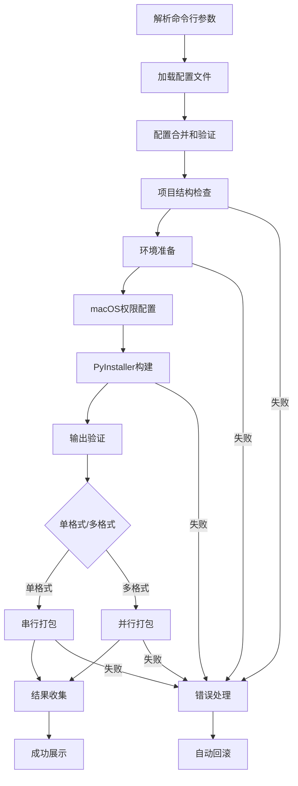

# UnifyPy 2.0 架构设计文档

## 1. 项目概述

UnifyPy 2.0 是一个专业的跨平台Python应用打包解决方案，采用全新的模块化架构设计，可将Python项目转换为Windows、macOS和Linux平台的原生安装包。相比1.0版本，2.0版本实现了企业级功能重构，支持30+种打包格式、并行构建、自动回滚等高级特性。

### 1.1 核心特性

- **🔄 多平台支持**: Windows (EXE+MSI)、macOS (DMG+PKG+ZIP)、Linux (DEB+RPM+AppImage+TarGZ)
- **⚡ 并行构建**: 支持多格式并行生成，显著提升构建效率
- **🛡️ 企业级功能**: 自动回滚、会话管理、智能错误处理
- **🎨 优秀体验**: Rich进度条、分阶段显示、详细日志
- **🔧 完整配置**: 支持30+PyInstaller参数，分层JSON配置
- **📦 自动化工具**: 第三方工具自动下载和管理

## 2. 架构设计

### 2.1 整体架构

UnifyPy 2.0 采用模块化架构，基于注册表模式和工厂模式实现平台无关的打包系统：

```
┌─────────────────────────────────────────────────────────────┐
│                      main.py                               │
│                 UnifyPyBuilder                             │
│            (主构建器和流程编排)                                │
└─────────────────┬───────────────────────────────────────────┘
                  │
┌─────────────────┼───────────────────────────────────────────┐
│                 ▼              src/core/                   │
│  ┌─────────────────┐     ┌─────────────────┐              │
│  │ ConfigManager   │     │ Environment     │              │
│  │   配置管理系统     │     │   环境检测      │              │
│  └─────────────────┘     └─────────────────┘              │
└─────────────────────────────────────────────────────────────┘
                  │
┌─────────────────┼───────────────────────────────────────────┐
│                 ▼          src/platforms/                  │
│  ┌─────────────────┐     ┌─────────────────┐              │
│  │ PackagerRegistry│────▶│ BasePackager    │              │
│  │   注册表机制     │     │   抽象基类      │              │
│  └─────────────────┘     └─────────────────┘              │
│           │                       │                       │
│           ▼                       ▼                       │
│  ┌─────────────┬─────────────┬─────────────┐              │
│  │ Windows     │ macOS       │ Linux       │              │
│  │ Packagers   │ Packagers   │ Packagers   │              │
│  └─────────────┴─────────────┴─────────────┘              │
└─────────────────────────────────────────────────────────────┘
                  │
┌─────────────────┼───────────────────────────────────────────┐
│                 ▼        src/pyinstaller/                  │
│  ┌─────────────────┐     ┌─────────────────┐              │
│  │ConfigBuilder    │     │ Builder         │              │
│  │ 配置构建器       │     │ 执行器          │              │
│  └─────────────────┘     └─────────────────┘              │
└─────────────────────────────────────────────────────────────┘
                  │
┌─────────────────┼───────────────────────────────────────────┐
│                 ▼            src/utils/                    │
│  ┌─────────────────┐  ┌─────────────────┐  ┌──────────────┐ │
│  │ ProgressManager │  │ ParallelBuilder │  │RollbackMgr   │ │
│  │   进度管理       │  │   并行构建       │  │  回滚系统    │ │
│  └─────────────────┘  └─────────────────┘  └──────────────┘ │
│  ┌─────────────────┐  ┌─────────────────┐  ┌──────────────┐ │
│  │ ToolManager     │  │ CommandRunner   │  │ FileOps      │ │
│  │   工具管理       │  │   命令执行       │  │  文件操作    │ │
│  └─────────────────┘  └─────────────────┘  └──────────────┘ │
└─────────────────────────────────────────────────────────────┘
```

### 2.2 目录结构

```
UnifyPy/
├── main.py                           # 主入口文件
├── build.json                        # 标准配置示例
├── build_multiformat.json            # 多格式配置
├── build_comprehensive.json          # 完整配置示例
├── py-xiaozhi.json                   # 实际项目配置示例
├── requirements.txt                  # Python依赖
└── src/                              # 源代码目录
    ├── core/                         # 核心模块
    │   ├── config.py                 # ConfigManager - 配置管理
    │   └── environment.py            # Environment - 环境检测
    ├── platforms/                    # 平台打包器
    │   ├── registry.py               # PackagerRegistry - 注册表
    │   ├── base.py                   # BasePackager - 抽象基类
    │   ├── windows/                  # Windows平台
    │   │   ├── inno_setup.py         # Inno Setup打包器
    │   │   └── msi_packager.py       # MSI打包器
    │   ├── macos/                    # macOS平台
    │   │   └── dmg_packager.py       # DMG打包器
    │   └── linux/                    # Linux平台
    │       ├── deb_packager.py       # DEB打包器
    │       ├── rpm_packager.py       # RPM打包器
    │       ├── appimage_packager.py  # AppImage打包器
    │       └── tarball_packager.py   # TAR.GZ打包器
    ├── pyinstaller/                  # PyInstaller集成
    │   ├── config_builder.py         # 配置构建器
    │   └── builder.py                # 构建器
    ├── tools/                        # 内置工具
    │   └── create-dmg/               # macOS DMG创建工具
    └── utils/                        # 工具模块
        ├── progress.py               # 进度管理器
        ├── parallel_builder.py       # 并行构建器
        ├── rollback.py               # 回滚管理器
        ├── tool_manager.py           # 工具管理器
        ├── command_runner.py         # 命令执行器
        ├── file_ops.py               # 文件操作
        ├── entitlements_generator.py # macOS权限生成
        ├── icon_converter.py         # 图标转换
        └── macos_codesign.py         # macOS代码签名
```

### 2.3 核心设计模式

#### 注册表模式 (Registry Pattern)
```python
class PackagerRegistry:
    """动态管理平台打包器的注册表"""
    def register_packager(self, platform: str, format_type: str, packager_class):
        """注册打包器类"""
        
    def get_packager(self, platform: str, format_type: str):
        """获取打包器类"""
```

**应用场景：**
- 动态注册和查找平台特定的打包器
- 支持运行时扩展新的打包格式
- 平台-格式映射的统一管理

#### 工厂模式 (Factory Pattern)
```python
# 通过注册表创建打包器实例
packager_class = registry.get_packager(platform, format_type)
packager = packager_class(progress, runner, tool_manager, config)
```

#### 策略模式 (Strategy Pattern)
```python
class BasePackager(ABC):
    """所有打包器的抽象基类"""
    @abstractmethod
    def package(self, format_type, source_path, output_path) -> bool:
        """平台特定的打包策略实现"""
```

#### 建造者模式 (Builder Pattern)
```python
class PyInstallerConfigBuilder:
    """构建复杂的PyInstaller配置"""
    def build_command(self, config, entry_script) -> List[str]:
        """构建PyInstaller命令"""
        
    def build_spec_file_content(self, config, entry_script) -> str:
        """构建.spec文件内容"""
```

#### 命令模式 (Command Pattern)
```python
class RollbackManager:
    """封装操作命令并支持撤销"""
    def safe_create_file(self, file_path, content):
        """可回滚的文件创建"""
        
    def rollback(self):
        """撤销所有操作"""
```

## 3. 核心组件详解

### 3.1 主入口点 (`main.py`)

```python
class UnifyPyBuilder:
    """主构建器类，协调整个构建过程"""
    
    def __init__(self):
        self.config = None
        self.progress = ProgressManager()
        self.runner = CommandRunner()
        self.rollback = None
        
    def build(self):
        """主构建流程"""
        try:
            self._validate_project()      # 项目验证
            self._prepare_environment()   # 环境准备
            self._build_executable()      # PyInstaller构建
            self._build_installer()       # 安装包生成
            self._show_success()          # 结果展示
        except Exception as e:
            self._handle_error(e)         # 错误处理和回滚
```

**核心职责：**
- 参数解析和配置管理
- 构建流程编排和异常处理
- 回滚会话管理和错误恢复
- 用户界面和进度跟踪

### 3.2 配置系统 (`src/core/`)

#### ConfigManager
```python
class ConfigManager:
    """分层配置系统"""
    
    def __init__(self, config_path=None, args=None):
        self.config = self._load_and_merge_config(config_path, args)
        
    def _load_and_merge_config(self, config_path, args):
        """配置加载和合并"""
        # 优先级：命令行参数 > 平台配置 > 全局配置 > 默认配置
        default_config = self._get_default_config()
        file_config = self._load_file_config(config_path)
        platform_config = self._get_platform_config(file_config)
        args_config = self._process_args(args)
        
        return self._deep_merge(default_config, file_config, 
                               platform_config, args_config)
```

**配置层次结构：**
1. **默认配置**: 系统内置的基础配置
2. **文件配置**: JSON配置文件的全局部分
3. **平台配置**: 当前平台的特定配置
4. **命令行配置**: 命令行参数覆盖

#### Environment
```python
class Environment:
    """环境检测和管理"""
    
    @staticmethod
    def get_platform():
        """获取当前平台"""
        
    @staticmethod
    def get_architecture():
        """获取当前架构"""
        
    @staticmethod
    def check_prerequisites():
        """检查前提条件"""
```

### 3.3 平台打包系统 (`src/platforms/`)

#### PackagerRegistry
```python
class PackagerRegistry:
    """打包器注册表"""
    
    def __init__(self):
        self._packagers = {}
        self._register_builtin_packagers()  # 注册内置打包器
        
    def get_all_platforms(self):
        """获取所有支持的平台"""
        
    def get_formats_for_platform(self, platform):
        """获取平台支持的格式"""
```

**支持的格式矩阵：**
- **Windows**: EXE (Inno Setup), MSI
- **macOS**: DMG, PKG, ZIP
- **Linux**: DEB, RPM, AppImage, TAR.GZ

#### BasePackager
```python
class BasePackager(ABC):
    """打包器抽象基类"""
    
    def __init__(self, progress, runner, tool_manager, config):
        self.progress = progress
        self.runner = runner
        self.tool_manager = tool_manager
        self.config = config
        
    @abstractmethod
    def package(self, format_type, source_path, output_path) -> bool:
        """平台特定的打包实现"""
        
    def validate_config(self) -> bool:
        """配置验证"""
        
    def generate_output_filename(self, format_type) -> str:
        """生成输出文件名"""
```

### 3.4 PyInstaller集成 (`src/pyinstaller/`)

#### PyInstallerConfigBuilder
```python
class PyInstallerConfigBuilder:
    """PyInstaller配置构建器"""
    
    # 支持30+个PyInstaller参数
    PYINSTALLER_OPTIONS = {
        'onefile': {'type': 'flag', 'option': '--onefile'},
        'windowed': {'type': 'flag', 'option': '--windowed'},
        'add_data': {'type': 'list', 'option': '--add-data'},
        'hidden_import': {'type': 'list', 'option': '--hidden-import'},
        # ... 更多参数
    }
    
    def build_command(self, config, entry_script) -> List[str]:
        """构建PyInstaller命令行"""
        command = ['pyinstaller']
        
        # 处理各类参数
        for key, value in config.get('pyinstaller', {}).items():
            if key in self.PYINSTALLER_OPTIONS:
                option_config = self.PYINSTALLER_OPTIONS[key]
                self._add_option(command, option_config, value)
                
        return command
```

**核心特性：**
- 完整的PyInstaller参数映射
- 平台特定处理（路径分隔符、图标格式等）
- macOS权限自动配置
- .spec文件生成支持

### 3.5 工具系统 (`src/utils/`)

#### ProgressManager
```python
class ProgressManager:
    """基于Rich的进度管理"""
    
    def __init__(self):
        self.console = Console()
        self.progress = None
        self.current_stage = None
        
    def start_stage(self, stage_name, description):
        """开始新阶段"""
        
    def update_stage(self, stage_name, percentage, status):
        """更新阶段进度"""
```

**特色功能：**
- 阶段权重分配：环境检查(10%) + PyInstaller(40%) + 安装包生成(40%) + 验证清理(10%)
- 实时耗时显示和最终用时统计
- 智能错误建议系统

#### ParallelBuilder
```python
class ParallelBuilder:
    """并行构建管理器"""
    
    def __init__(self, progress, max_workers=None):
        self.max_workers = max_workers or min(4, os.cpu_count() + 1)
        self.executor = ThreadPoolExecutor(max_workers=self.max_workers)
        
    def build_multiple_formats(self, platform, formats, registry, 
                              source_path, output_dir, config):
        """并行构建多种格式"""
        futures = []
        for format_type in formats:
            future = self.executor.submit(
                self._build_single_format, 
                platform, format_type, registry, source_path, output_dir, config
            )
            futures.append((format_type, future))
            
        return self._collect_results(futures)
```

#### RollbackManager
```python
class RollbackManager:
    """企业级回滚系统"""
    
    def __init__(self, project_dir, progress):
        self.session_id = self._generate_session_id()
        self.operations = []
        self.project_dir = project_dir
        
    def safe_create_file(self, file_path, content):
        """可回滚的文件创建"""
        self._backup_if_exists(file_path)
        self._record_operation('CREATE_FILE', file_path)
        Path(file_path).write_text(content, encoding='utf-8')
        
    def rollback(self):
        """执行回滚操作"""
        for operation in reversed(self.operations):
            self._rollback_operation(operation)
```

**操作类型：**
- CREATE_FILE, CREATE_DIR: 创建操作
- MODIFY_FILE, DELETE_FILE: 修改和删除操作
- MOVE_FILE, COPY_FILE: 移动和复制操作

## 4. 构建流程详解

### 4.1 主流程



### 4.2 详细阶段

#### 1. 初始化阶段 (10% 权重)
```python
def _validate_project(self):
    """项目验证阶段"""
    # 检查项目目录存在性
    # 验证入口文件
    # 检查PyInstaller可用性
    # 验证磁盘空间
    # 配置有效性检查
```

#### 2. PyInstaller构建阶段 (40% 权重)
```python
def _build_executable(self):
    """可执行文件构建阶段"""
    # macOS权限配置自动生成
    # PyInstaller配置构建
    # 命令执行和监控
    # 输出文件验证
    # macOS Info.plist更新和代码签名
```

#### 3. 安装包生成阶段 (40% 权重)
```python
def _build_installer(self):
    """安装包生成阶段"""
    # 获取请求的输出格式
    # 选择串行或并行构建
    # 打包器实例化和执行
    # 结果验证和收集
```

#### 4. 验证清理阶段 (10% 权重)
```python
def _show_success(self):
    """最终处理阶段"""
    # 收集所有输出文件信息
    # 显示构建结果摘要
    # 清理临时文件
    # 显示使用建议
```

## 5. 企业级功能

### 5.1 自动回滚系统

**实现机制：**
- 使用上下文管理器自动触发回滚
- 操作前自动备份，异常时恢复
- 支持会话管理和手动回滚
- JSON格式的操作日志持久化

**使用示例：**
```python
with RollbackManager(project_dir, progress) as rollback:
    rollback.safe_create_file(Path("test.txt"), "content")
    rollback.safe_modify_file(Path("config.json"), new_content)
    # 如果发生异常，自动回滚所有操作
```

### 5.2 并行构建系统

**性能优化：**
```python
# 智能线程数分配
max_workers = min(4, os.cpu_count() + 1)

# 增量构建检测
if self._should_skip_pyinstaller_build(source_path):
    self.progress.update_current_stage(100, "使用缓存的可执行文件")
    return True

# UPX压缩优化
if self._should_enable_upx():
    command.extend(['--upx-dir', upx_path])
```

### 5.3 工具管理系统

**自动化特性：**
```python
class ToolManager:
    """第三方工具自动管理"""
    
    def ensure_tool(self, tool_name: str, version: str = "latest") -> str:
        """确保工具可用，自动下载如果不存在"""
        
    def _install_binary_tool(self, tool_name: str, repo: str, version: str):
        """从GitHub自动下载二进制工具"""
        
    def _detect_existing_inno_setup(self):
        """自动检测已安装的Inno Setup"""
```

### 5.4 智能错误处理

**错误诊断和建议：**
```python
def _handle_error(self, error):
    """智能错误处理"""
    error_suggestions = {
        "PyInstaller": "检查Python版本和依赖项，尝试使用 --clean 重新构建",
        "权限": "确保有足够的文件系统权限，尝试以管理员身份运行",
        "工具": "检查第三方工具安装，参考工具管理文档"
    }
    
    suggestion = self._get_error_suggestion(error)
    self.progress.show_error(str(error), suggestion)
    
    if self.rollback:
        self.rollback.rollback()
```

## 6. 相比1.0版本的架构改进

### 6.1 架构层面

| 方面 | 1.0版本 | 2.0版本 |
|------|---------|---------|
| **架构设计** | 单体架构，功能耦合 | 模块化架构，低耦合高内聚 |
| **扩展性** | 硬编码格式支持 | 注册表机制，动态扩展 |
| **设计模式** | 简单工厂模式 | 注册表+工厂+策略+建造者+命令模式 |
| **配置系统** | 简单配置文件 | 分层配置，平台特定覆盖 |

### 6.2 功能层面

| 功能 | 1.0版本 | 2.0版本 |
|------|---------|---------|
| **基础打包** | ✅ 基础功能 | ✅ 30+参数支持 |
| **并行构建** | ❌ 不支持 | ✅ 多线程并行 |
| **回滚系统** | ❌ 不支持 | ✅ 企业级回滚 |
| **进度显示** | ❌ 基础输出 | ✅ Rich现代化界面 |
| **工具管理** | ❌ 手动安装 | ✅ 自动下载管理 |
| **错误处理** | ❌ 基础信息 | ✅ 智能诊断建议 |

### 6.3 用户体验

| 体验方面 | 1.0版本 | 2.0版本 |
|----------|---------|---------|
| **界面** | 命令行文本输出 | Rich库现代化进度界面 |
| **反馈** | 简单成功/失败 | 实时进度+智能建议 |
| **可靠性** | 基础错误处理 | 自动回滚+会话管理 |
| **性能** | 串行构建 | 并行构建+缓存优化 |

## 7. 技术亮点

### 7.1 完整的PyInstaller集成
- 支持30+参数的完整映射
- 智能平台适配（路径分隔符、图标格式）
- macOS权限自动生成和代码签名
- .spec文件生成和自定义支持

### 7.2 企业级可靠性
- 自动回滚机制确保构建安全性
- 会话管理支持手动回滚
- 智能错误诊断和恢复建议
- 操作日志持久化

### 7.3 高性能并行构建
- 多格式并行生成，显著提升效率
- 增量构建检测，避免重复编译
- UPX压缩自动优化
- 智能线程池管理

### 7.4 现代化用户体验
- Rich库驱动的进度显示
- 实时耗时统计和完成时间
- 分阶段权重进度展示
- 彩色状态和图标提示

## 8. 扩展开发指南

### 8.1 添加新的平台支持

1. 创建平台目录：`src/platforms/newplatform/`
2. 实现打包器类：继承`BasePackager`
3. 注册打包器：在`PackagerRegistry`中注册
4. 添加平台检测：在`Environment`中添加检测逻辑

```python
class NewPlatformPackager(BasePackager):
    def package(self, format_type, source_path, output_path) -> bool:
        # 实现平台特定的打包逻辑
        pass
        
# 在registry中注册
registry.register_packager("newplatform", "format", NewPlatformPackager)
```

### 8.2 添加新的打包格式

1. 在对应平台目录下创建格式打包器
2. 实现格式特定的打包逻辑
3. 在注册表中注册新格式
4. 更新配置系统支持新格式选项

### 8.3 扩展PyInstaller支持

1. 在`PyInstallerConfigBuilder.PYINSTALLER_OPTIONS`中添加新参数
2. 实现参数处理逻辑
3. 更新配置文件示例
4. 添加参数验证和文档

## 9. 故障排除

### 9.1 常见问题诊断

**PyInstaller构建失败：**
```bash
# 启用详细输出
python main.py . --config build.json --verbose

# 清理重建
python main.py . --config build.json --clean --verbose
```

**并行构建失败：**
```bash
# 减少工作线程
python main.py . --parallel --max-workers 2

# 禁用并行构建
python main.py . --config build.json
```

**回滚系统问题：**
```bash
# 列出可用会话
python main.py . --list-rollback

# 手动回滚
python main.py . --rollback SESSION_ID
```

### 9.2 调试技巧

1. **启用详细输出**: `--verbose`查看详细构建日志
2. **分阶段调试**: 使用`--skip-exe`或`--skip-installer`
3. **回滚测试**: 使用`--list-rollback`查看历史操作
4. **配置验证**: 检查配置文件合并结果

## 10. 性能优化建议

### 10.1 构建性能
- 启用并行构建：`--parallel --max-workers 4`
- 使用增量构建：避免重复PyInstaller编译
- 启用UPX压缩：减小可执行文件体积
- 合理配置`exclude_module`：减少打包内容

### 10.2 开发效率
- 使用配置文件模板：标准化项目配置
- 启用详细输出：快速定位问题
- 利用回滚系统：安全试错和快速恢复
- 缓存工具下载：减少重复下载时间

UnifyPy 2.0通过这种精心设计的模块化架构，不仅解决了跨平台打包的技术挑战，还提供了企业级的可靠性、性能和用户体验，是Python应用打包领域的一个成熟、可扩展的解决方案。